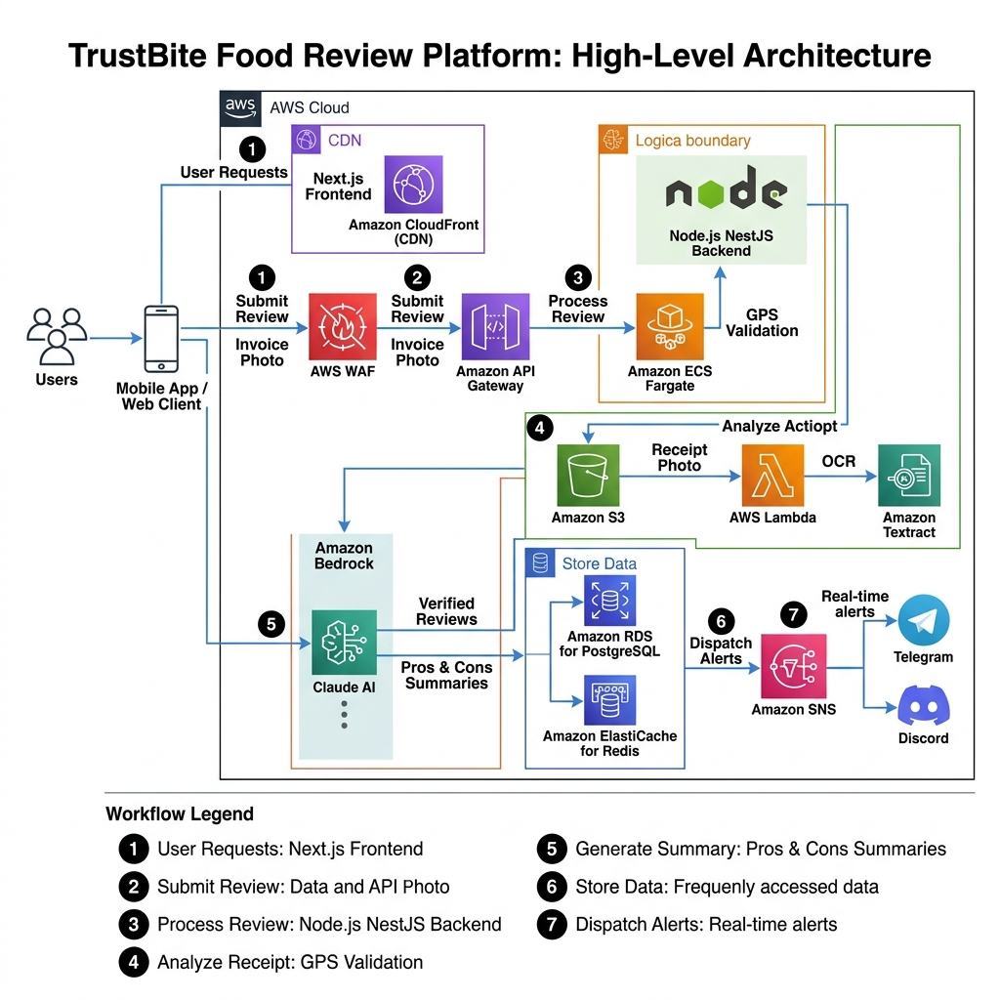
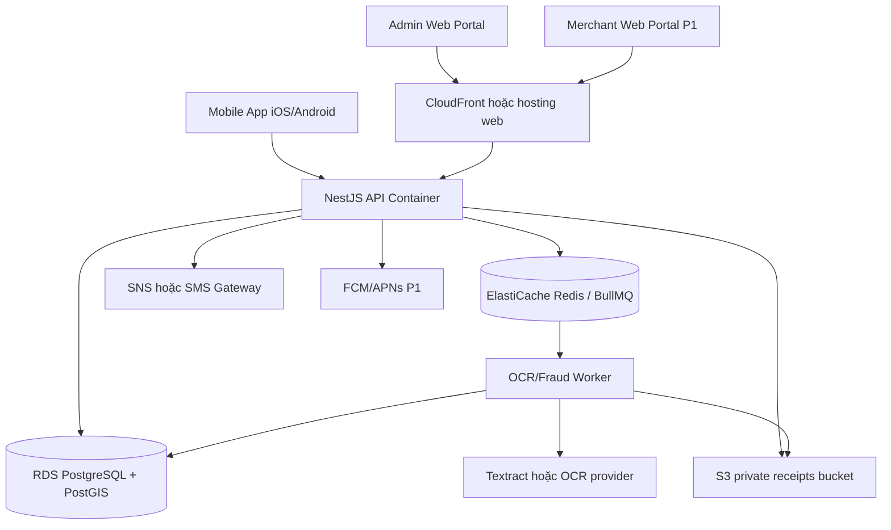

# Đặc tả hạ tầng AWS Cloud - TrustBite

| Thông tin tài liệu | Chi tiết |
|---|---|
| Loại tài liệu | Đặc tả hạ tầng AWS |
| Phiên bản | v2.2.0 |
| Trạng thái | Đang rà soát |
| Chủ sở hữu | Kiến trúc sư Cloud / DevOps |
| Ngày cập nhật | 2026-06-07 |

---

## 1. Phạm vi

Tài liệu này mô tả phương án AWS tham chiếu cho MVP mobile-first. MVP cần tối ưu chi phí và độ đơn giản, không bắt buộc triển khai toàn bộ dịch vụ enterprise ngay từ đầu.

Sơ đồ kiến trúc hiện có từ repo được giữ làm tài liệu tham chiếu:

Lưu ý: sơ đồ có thể thể hiện một số thành phần tương lai hoặc enterprise. Bảng ánh xạ dịch vụ bên dưới mới là chuẩn áp dụng cho MVP.

---

## 2. Kiến trúc AWS tham chiếu cho MVP

---

## 3. Luồng dữ liệu từng bước

### 3.1. Đăng nhập / OTP

1. Người dùng gửi số điện thoại từ mobile app.
2. API kiểm tra số điện thoại và giới hạn tần suất.
3. API tạo hash OTP và gửi qua SNS hoặc SMS Gateway.
4. Người dùng nhập OTP.
5. API xác thực OTP và tạo access token + refresh/session token.
6. Mobile app lưu token bằng secure storage.

### 3.2. Gửi đánh giá

1. Người dùng mở chi tiết quán trên mobile app.
2. Người dùng gửi điểm 4 tiêu chí và bình luận.
3. API kiểm tra quy tắc nghiệp vụ.
4. API tạo `reviews.status = SUBMITTED`.
5. API trả `nextStep = UPLOAD_RECEIPT` hoặc `SKIP_VERIFICATION` theo lựa chọn sản phẩm.

### 3.3. Xác minh hóa đơn

1. Người dùng chọn/chụp hóa đơn từ mobile app.
2. Mobile app kiểm tra sơ bộ định dạng/dung lượng, nén ảnh nếu chính sách cho phép và hiển thị thông báo quyền riêng tư.
3. Người dùng cấp GPS nếu muốn.
4. Mobile app tải hóa đơn qua API multipart hoặc signed upload flow.
5. API kiểm tra định dạng và dung lượng file.
6. API lưu ảnh vào S3 bucket riêng tư.
7. API tạo `receipt_verifications.status = UPLOADED`.
8. API đưa job vào Redis/BullMQ.
9. Worker tính SHA-256 hash và kiểm tra trùng hóa đơn.
10. Worker gọi Textract/OCR provider để đọc hóa đơn.
11. Worker tính độ tương đồng OCR, rủi ro thời gian và rủi ro GPS nếu có.
12. Worker tính điểm rủi ro gian lận.
13. Worker cập nhật kết quả: `VERIFIED`, `PENDING_ADMIN_REVIEW`, `REFERENCE_ONLY` hoặc `REJECTED`.
14. Mobile app lấy lại trạng thái bằng polling/refetch hoặc notification P1.

### 3.4. Quyết định của quản trị viên

1. Quản trị viên mở hàng đợi đang chờ xử lý trên admin portal.
2. Quản trị viên xem hóa đơn, kết quả OCR, khoảng cách GPS và điểm rủi ro gian lận.
3. Quản trị viên chọn quyết định và nhập lý do.
4. API cập nhật trạng thái đối tượng liên quan.
5. API ghi audit log.
6. API tạo thông báo nếu cần.

### 3.5. Tóm tắt AI

Tóm tắt AI bằng Bedrock/LLM là tính năng **tương lai**, không thuộc MVP. Nếu triển khai sau này, job AI phải chạy bất đồng bộ và có cơ chế kiểm soát chi phí riêng.

---

## 4. Bảng ánh xạ dịch vụ

| Năng lực | Phương án MVP | Phương án tương lai |
|---|---|---|
| Mobile distribution | TestFlight, Google Play Internal Testing | Production store release, phased rollout |
| Hosting admin/merchant web | Amplify/Vercel/S3 + CloudFront | Tối ưu CDN đa vùng |
| Compute API | ECS Fargate hoặc nền tảng container managed | Tự động mở rộng nhiều service |
| Compute worker | ECS worker hoặc container job | Worker fleet chuyên dụng |
| Database | RDS PostgreSQL một vùng kèm backup | Multi-AZ, read replica, RDS Proxy |
| Queue/cache | Redis/BullMQ | Cụm Redis managed |
| Object storage | S3 bucket riêng tư | Lifecycle/Glacier, malware scanning |
| OCR | Textract hoặc OCR provider tương đương | Failover nhiều provider |
| OTP/SMS | SNS hoặc SMS Gateway | Dự phòng nhiều provider SMS |
| Push notification | Không bắt buộc MVP, FCM/APNs nếu cần thông báo trạng thái | Notification orchestration service |
| Secrets | Secrets Manager/SSM | Tự động rotate secrets |
| Bảo mật | WAF tùy chọn cho production | WAF/bot protection nâng cao |
| AI/LLM | Không thuộc MVP | Bedrock hoặc LLM provider bên ngoài |

---

## 5. Yêu cầu bảo mật MVP

- Bucket hóa đơn phải ở chế độ riêng tư.
- Chỉ truy cập file riêng tư qua signed URL có thời hạn ngắn.
- DB nên nằm trong mạng riêng nếu hạ tầng cho phép.
- Secret không được lưu trong mã nguồn hoặc bundle mobile.
- API phải giới hạn tần suất với OTP, đánh giá và upload.
- Upload phải kiểm tra dung lượng và định dạng file ở backend, không chỉ dựa vào mobile app.
- Log không được chứa OTP, token, toàn bộ text hóa đơn hoặc GPS gốc, trừ khi thực sự cần cho audit bảo mật.
- GPS là tùy chọn và phải có thời gian lưu giữ giới hạn.
- Token mobile phải có vòng đời rõ ràng và cơ chế revoke khi người dùng đăng xuất hoặc tài khoản bị khóa.

---

## 6. Kiểm soát chi phí

| Nguồn chi phí | Cách kiểm soát |
|---|---|
| OCR | Xử lý bất đồng bộ, giới hạn retry, chỉ OCR file hợp lệ. |
| Lưu trữ | Áp dụng lifecycle theo chính sách lưu giữ hóa đơn. |
| Compute | Bắt đầu nhỏ; scale worker tách khỏi API. |
| Database | Chưa dùng read replica nếu lưu lượng đọc chưa đủ lớn. |
| AI/LLM | Không thuộc MVP. |
| SMS | Giới hạn tần suất OTP và phát hiện lạm dụng. |
| Mobile crash/analytics | Bắt đầu bằng gói miễn phí hoặc usage cap rõ ràng. |

---

## 7. Môi trường

| Môi trường | Mục đích |
|---|---|
| Local | Kiểm thử local với Docker PostgreSQL/Redis và app mobile trỏ về API local/staging. |
| Staging | QA/UAT với dữ liệu seed và OCR mock hoặc sandbox provider. |
| Beta | TestFlight/Google Play Internal Testing với backend staging hoặc beta riêng. |
| Production | Người dùng thật, backup, monitoring và kiểm soát truy cập. |

---

## 8. Ghi chú triển khai

- Asset sơ đồ kiến trúc nằm tại `assets/trustbite_architecture.png`.
- Nếu sơ đồ và bảng MVP có mâu thuẫn, dùng bảng MVP làm nguồn chuẩn để triển khai.
- Dịch vụ tương lai phải được cập nhật vào PRD/SRS/API/DB/QA trước khi triển khai.
- Mobile release checklist nằm tại `09_Operations_and_Maintenance/Mobile_Release_Checklist.md`.
