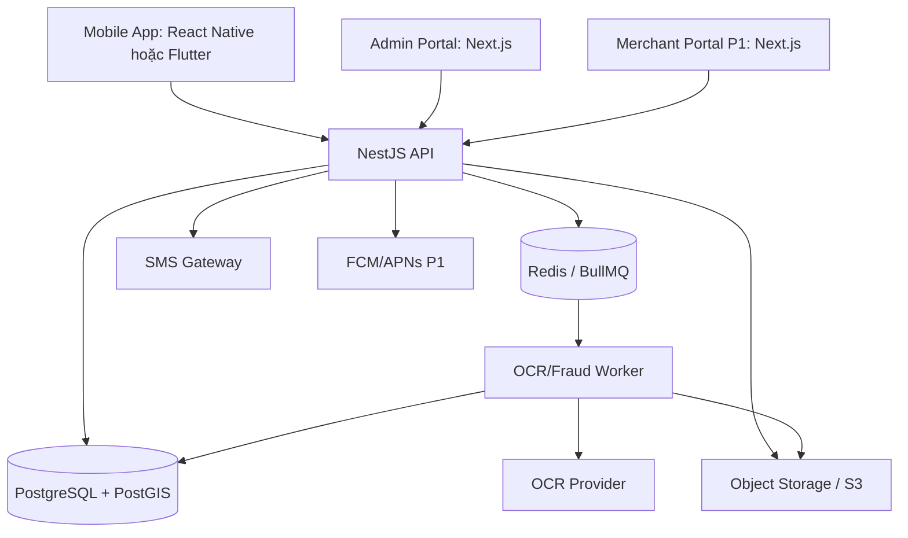

# Thiết kế kiến trúc hệ thống - TrustBite

| Thông tin tài liệu | Chi tiết |
|---|---|
| Loại tài liệu | Thiết kế kiến trúc hệ thống |
| Phiên bản | v2.2.0 |
| Trạng thái | Đang rà soát |
| Chủ sở hữu | Kiến trúc sư hệ thống |
| Ngày cập nhật | 2026-06-07 |

---

## 1. Nguyên tắc kiến trúc

MVP sử dụng **modular monolith** để giảm độ phức tạp triển khai nhưng vẫn chia module rõ ràng để có thể tách service sau này nếu cần.

TrustBite được thiết kế theo hướng **mobile-first**:

- Mobile app là client chính cho người dùng cuối.
- Admin portal là web app riêng cho vận hành và kiểm duyệt.
- Merchant portal là P1/V1.1, ưu tiên web portal trước app riêng.
- OCR, chống gian lận, thông báo và các xử lý tốn thời gian chạy bất đồng bộ bằng hàng đợi.

Không dùng microservices đầy đủ ở MVP trừ khi có nhu cầu vận hành thật.

---

## 2. Kiến trúc MVP



---

## 3. Client architecture

| Client | Trách nhiệm | Ghi chú MVP |
|---|---|---|
| Mobile app | Đăng nhập OTP, tìm kiếm quán, bản đồ, chi tiết quán, gửi đánh giá, upload hóa đơn, GPS tùy chọn, hồ sơ, nhận trạng thái xác minh | Client chính của sản phẩm |
| Admin portal | Hàng đợi hóa đơn, kiểm duyệt nội dung, duyệt claim, audit log, quản lý trạng thái quán/người dùng | Cần màn hình lớn, bảng dữ liệu, bộ lọc nâng cao |
| Merchant portal | Claim quán, cập nhật thông tin, phản hồi đánh giá, báo cáo đánh giá | P1/V1.1, không chặn MVP nếu chưa cần kiểm chứng giả thuyết chính |

Mobile app không xử lý quyết định gian lận ở client. Client chỉ thu thập dữ liệu, gọi API, hiển thị trạng thái và giải thích kết quả cho người dùng.

---

## 4. Module phía backend

| Module | Trách nhiệm |
|---|---|
| AuthModule | Yêu cầu/xác thực OTP, access token, refresh/session token, giới hạn tần suất. |
| UserModule | Hồ sơ, vai trò, cấp hạng, trạng thái tài khoản. |
| RestaurantModule | Tìm kiếm, chi tiết, truy vấn bản đồ, trạng thái quán. |
| ReviewModule | Gửi đánh giá, chuyển trạng thái, media. |
| ReceiptModule | Tải hóa đơn, kiểm tra hash, điều phối OCR. |
| FraudModule | Tính điểm rủi ro, tạo cờ gian lận. |
| AdminModule | Hàng đợi và quyết định thủ công. |
| ModerationModule | Báo cáo và hành động kiểm duyệt. |
| MerchantModule | Claim quán, cập nhật hồ sơ, phản hồi của chủ quán. |
| NotificationModule | Thông báo trong ứng dụng, push notification sau MVP nếu cần. |
| GamificationModule | EXP và cấp hạng cơ bản. |

---

## 5. Kiến trúc dữ liệu

Thiết kế cơ sở dữ liệu chính nằm tại:

```text
06_Database_Design/PostgreSQL_Database_Schema.md
06_Database_Design/ERD.md
06_Database_Design/Data_Dictionary.md
```

Các điểm tách biệt quan trọng:

- `reviews` lưu nội dung đánh giá và điểm đánh giá.
- `receipt_verifications` lưu OCR/GPS/hash/rủi ro/quyết định.
- `fraud_flags` lưu tín hiệu nghi vấn.
- `moderation_reports` và `moderation_actions` lưu quy trình xử lý tranh chấp nội dung.
- `audit_logs` lưu hành động của quản trị viên, chủ quán và hệ thống.
- Mobile token/session cần được thiết kế rõ trong implementation, có thể thêm bảng `sessions` hoặc `refresh_tokens` khi chốt auth strategy.
- Push token cần bảng riêng nếu notification P1 được triển khai.

---

## 6. Luồng request: đánh giá đã xác minh

```text
Người dùng gửi đánh giá từ mobile app
→ API kiểm tra đánh giá
→ reviews.status = SUBMITTED
→ Mobile app chuyển sang bước tải hóa đơn hoặc bỏ qua xác minh
→ Người dùng tải hóa đơn
→ API kiểm tra file và lưu file ở vùng riêng tư
→ API tạo receipt_verifications.status = UPLOADED
→ Worker kiểm tra hash + OCR + rủi ro GPS
→ Tính điểm rủi ro gian lận
→ Quyết định tự động hoặc chuyển quản trị viên xử lý
→ Cập nhật trạng thái đánh giá
→ Ghi audit log hoặc tạo thông báo nếu cần
→ Mobile app poll/refetch hoặc nhận thông báo để hiển thị kết quả
```

---

## 7. Mục tiêu phi chức năng MVP

| Nhóm | Mục tiêu |
|---|---|
| Độ trễ tìm kiếm | p95 < 1s với dataset MVP |
| Trang chi tiết quán | p95 < 1s với dataset MVP |
| Tải hóa đơn | API trả trạng thái xử lý trong <3s |
| OCR | Worker bất đồng bộ có retry và timeout |
| Mobile startup | App mở được màn hình đầu tiên trong ngưỡng chấp nhận của beta, theo dõi bằng analytics/crash reporting |
| Khả dụng | Mục tiêu MVP 99.5% |
| Bảo mật | Giới hạn tần suất, auth guard, kiểm tra file, signed URL riêng tư, token secure storage |
| Quyền riêng tư | GPS tùy chọn, hóa đơn riêng tư theo mặc định, có chính sách lưu giữ dữ liệu |
| Observability | API logs, queue metrics, OCR job logs, mobile crash/error reporting |

---

## 8. Lựa chọn kiến trúc tương lai

| Dấu hiệu kích hoạt | Nâng cấp có thể áp dụng |
|---|---|
| Lưu lượng API tăng | Tách service đọc nhiều cho quán/tìm kiếm. |
| Hàng đợi OCR tăng | Tách worker fleet chuyên dụng và autoscaling. |
| DB bị nghẽn đọc | Bổ sung read replica và cache. |
| Gian lận phức tạp hơn | Tách service phân tích gian lận. |
| Chủ quán cần thao tác mobile nhiều | Tạo merchant mobile app hoặc module merchant trong app hiện tại. |
| Tóm tắt AI được triển khai | Tách job service AI và cơ chế kiểm soát chi phí. |
