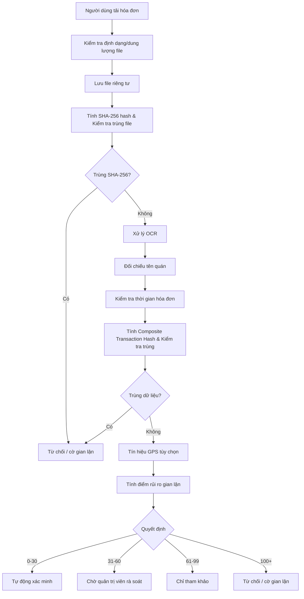

# Đặc tả chống gian lận và thuật toán tin cậy - TrustBite

| Thông tin tài liệu | Chi tiết |
|---|---|
| Loại tài liệu | Đặc tả chống gian lận |
| Phiên bản | v2.0.0 |
| Trạng thái | Đang rà soát |
| Chủ sở hữu | Kiến trúc sư bảo mật / Trưởng nhóm dữ liệu |
| Ngày cập nhật | 2026-06-07 |

---

## 1. Mục tiêu

Chống gian lận của MVP không dùng quy tắc cứng cho mọi trường hợp. Hệ thống dùng **chấm điểm rủi ro** để kết hợp nhiều tín hiệu: hash hóa đơn, OCR, thời gian hóa đơn, GPS, metadata ảnh và hành vi tài khoản. Cách này thực tế hơn vì OCR/GPS có sai số.

---

## 2. Nguyên tắc ra quyết định

- Hash hóa đơn trùng là tín hiệu nghiêm trọng nhất.
- OCR/GPS không nên là điều kiện tuyệt đối duy nhất.
- GPS là tùy chọn và phải tuân thủ chính sách quyền riêng tư.
- Tất cả quyết định tự động/thủ công phải có lý do và có thể audit.
- Chấm điểm rủi ro V1 phải đơn giản, dễ điều chỉnh sau beta.

---

## 3. Luồng xác minh hóa đơn



---

## 4. Điểm rủi ro gian lận V1

### 4.1. Chấm điểm tín hiệu

| Điều kiện | Điểm rủi ro |
|---|---:|
| GPS trong 200m | +0 |
| GPS lệch >200m (khi gửi đánh giá tại quán trong vòng 1 giờ) | +40 |
| GPS lệch >200m (khi gửi đánh giá từ xa/trễ sau 1 giờ) | +10 |
| GPS không bật / người dùng không cấp quyền | +30 |
| GPS accuracy >100m | +15 |
| OCR tên quán khớp 80-100% | +0 |
| OCR tên quán khớp 60-79% | +25 |
| OCR tên quán khớp <60% | +60 |
| OCR không đọc được tên quán | +50 |
| Hóa đơn trong 48 giờ | +0 |
| Hóa đơn 49-168 giờ | +40 |
| Hóa đơn >168 giờ | +70 |
| Không đọc được thời gian hóa đơn | +30 |
| Hash ảnh trùng (SHA-256) | +100 |
| Trùng thông tin giao dịch (Composite Hash) | +100 |
| Ảnh sai định dạng/quá dung lượng | Reject trước scoring |
| Metadata ảnh có dấu hiệu chỉnh sửa | +50 |
| Người dùng mới tạo <24h và đánh giá đầu tiên | +15 |
| Người dùng có >=3 hóa đơn bị từ chối trong 7 ngày | +40 |
| Nhiều tài khoản cùng thiết bị/IP đánh giá cùng quán trong 24h | +50 |

### 4.2. Ngưỡng quyết định

| Fraud Risk Score | Kết quả | Ý nghĩa |
|---:|---|---|
| 0-30 | Tự động xác minh | Rủi ro thấp, đánh giá được xác minh tự động. |
| 31-60 | Chờ quản trị viên rà soát | Cần quản trị viên kiểm tra. |
| 61-99 | Chỉ tham khảo | Không đủ tin cậy để xác minh nhưng chưa cần từ chối. |
| 100+ | Từ chối / cờ gian lận | Tín hiệu gian lận nghiêm trọng hoặc hash trùng. |

---

## 5. Tính khoảng cách GPS

Hệ thống dùng Haversine để tính khoảng cách giữa vị trí người dùng và quán.

```text
d = 2R * asin(sqrt(sin²(Δφ/2) + cos(φ1) * cos(φ2) * sin²(Δλ/2)))
```

Trong đó:

- `R = 6,371,000m`.
- `φ1`, `φ2` là vĩ độ dạng radian.
- `Δφ`, `Δλ` là độ lệch vĩ độ/kinh độ.

GPS chỉ là tín hiệu. Không có GPS không làm hệ thống tự động từ chối.

---

## 6. Đối chiếu tên quán bằng OCR

Dùng Levenshtein similarity giữa tên quán OCR và tên quán trong hệ thống.

```text
similarity = (1 - levenshteinDistance(ocrName, restaurantName) / maxLength) * 100
```

| Độ tương đồng | Điểm rủi ro |
|---|---:|
| 80-100% | +0 |
| 60-79% | +25 và chờ duyệt thủ công nếu tổng score trung bình |
| <60% | +60 |
| Không đọc được | +50 |

Hệ thống nên chuẩn hóa trước khi so khớp:

- chuyển về chữ thường,
- bỏ dấu tiếng Việt,
- bỏ ký tự đặc biệt,
- chuẩn hóa khoảng trắng,
- loại bỏ hậu tố phổ biến như `Co., Ltd`, `CN`, `chi nhánh` nếu cần.

---

## 7. Chống trùng hóa đơn nhiều lớp

### 7.1. Trùng lặp Hash file ảnh (SHA-256)
- Tính SHA-256 trên file gốc. Nếu hash đã tồn tại trong `receipt_verifications` với trạng thái không phải lỗi kỹ thuật, hóa đơn mới bị từ chối tự động.
- Tạo `fraud_flags` với loại `DUPLICATE_RECEIPT_HASH`.

### 7.2. Trùng lặp thông tin giao dịch (Composite Transaction Hash)
- Chụp ảnh ở góc khác nhau sẽ làm thay đổi SHA-256 của file nhưng thông tin giao dịch vẫn giữ nguyên. Do đó, hệ thống sinh một khóa duy nhất sau khi OCR thành công:
  $$\text{transaction\_unique\_hash} = \text{SHA256}(\text{normalized\_restaurant\_name} + \text{transaction\_datetime} + \text{invoice\_no} + \text{total\_amount})$$
- Trong đó:
  - `normalized_restaurant_name`: Tên quán đã được chuyển thường, loại bỏ dấu, khoảng trắng thừa và ký tự đặc biệt.
  - `transaction_datetime`: Ngày giờ giao dịch được chuẩn hóa về định dạng ISO.
  - `invoice_no`: Số hóa đơn hoặc mã giao dịch (mã định danh duy nhất trên hóa đơn).
  - `total_amount`: Tổng số tiền thanh toán trên hóa đơn.
- Nếu `transaction_unique_hash` trùng với hóa đơn đã được xác minh trước đó trong hệ thống, hóa đơn mới sẽ bị tự động từ chối.
- Tạo `fraud_flags` với loại `DUPLICATE_TRANSACTION_HASH`.

Quy tắc kiểm tra trùng hai lớp này được xem là quy tắc cứng trong MVP.

---

## 8. Tín hiệu chỉnh sửa ảnh

MVP chỉ nên làm kiểm tra nhẹ:

| Kiểm tra | MVP? | Ghi chú |
|---|---|---|
| Validate định dạng/dung lượng file | Có | Từ chối trước khi OCR. |
| Từ khóa phần mềm trong EXIF | Có thể | Chỉ tăng rủi ro, không reject cứng. |
| Thiếu dữ liệu camera trong EXIF | Không bắt buộc | Nhiều ứng dụng nén ảnh làm mất EXIF. |
| Phân tích ELA | Tương lai | Không nên đưa MVP vì tốn công và dễ dương tính giả. |
| Phát hiện chỉnh sửa ảnh bằng AI | Tương lai | Cần dữ liệu thật để huấn luyện/đánh giá. |

---

## 9. Phòng chống Sybil / tài khoản clone

### MVP

- Giới hạn tần suất OTP: Tối đa 3 lần/10 phút cho mỗi số điện thoại. Sai 5 lần liên tiếp sẽ bị khóa tạm thời (Khóa 15 phút cho lần đầu, 24 giờ cho lần vi phạm tiếp theo).
- Lưu trạng thái rate limit và danh sách khóa tạm thời (blacklisted phone numbers) trên Redis để truy xuất nhanh với độ trễ thấp.
- Giới hạn tần suất đánh giá/tải hóa đơn.
- Theo dõi IP/user-agent ở mức bảo mật cơ bản.
- Ghi `fraud_flags` khi nhiều tài khoản đánh giá cùng quán với mẫu hành vi bất thường.

### V1.1/Tương lai

- Fingerprint thiết bị chỉ được triển khai nếu có cơ sở pháp lý, đồng ý rõ ràng và thời gian lưu giữ ngắn.
- AI đồ thị hành vi chỉ làm sau khi có dữ liệu thật.
- Shadowban cần chính sách nội bộ minh bạch và phê duyệt của Pháp lý/Sản phẩm.

---

## 10. Điểm tin cậy quán V1

```text
RestTrustScore = sum(Rating_i * Trọng số_i) / sum(Trọng số_i)
```

| Loại đánh giá | Cấp hạng người dùng | Trọng số |
|---|---|---:|
| Đánh giá tham khảo | Bất kỳ | 0.1 |
| Đánh giá đã xác minh | Newbie | 0.5 |
| Đánh giá đã xác minh | Apprentice | 0.8 |
| Đánh giá đã xác minh | Foodie | 1.0 |
| Đánh giá đã xác minh | Trusted Foodie | 1.5 |
| Hidden/Rejected/Deleted | Bất kỳ | 0 |

Rating_i là trung bình 4 tiêu chí: món ăn, giá, phục vụ, không gian.

---

## 11. Yêu cầu audit

Mọi quyết định sau phải ghi audit:

- quản trị viên duyệt/từ chối hóa đơn,
- quản trị viên ẩn/xóa đánh giá,
- quản trị viên duyệt/từ chối claim của chủ quán,
- override điểm gian lận,
- khóa hoặc hạn chế người dùng,
- yêu cầu xóa dữ liệu.

Audit log tối thiểu gồm:

```text
actor_id, actor_role, action, entity_type, entity_id, previous_status, new_status, reason, created_at
```
