# Sơ đồ quan hệ thực thể - TrustBite

| Thông tin tài liệu | Chi tiết |
|---|---|
| Loại tài liệu | Entity relationship diagram |
| Phiên bản | v2.7.0 |
| Trạng thái | Đã cập nhật |
| Chủ sở hữu | DBA |
| Ngày cập nhật | 2026-06-09 |

---

## ERD logic

```mermaid
erDiagram
    roles ||--o{ user_roles : gan_vai_tro
    rank_definitions ||--o{ users : xep_hang
    users ||--o{ reviews : viet_danh_gia
    users ||--o{ otp_verifications : xac_thuc_otp
    users ||--o{ user_roles : co_vai_tro
    users ||--o{ user_sessions : co_phien
    users ||--o{ user_follows : theo_doi
    users ||--o{ user_follows : duoc_theo_doi
    users ||--o{ review_votes : binh_chon
    users ||--o{ account_deletion_requests : yeu_cau_xoa_tai_khoan
    users ||--o{ user_blocks : chan_nguoi_dung
    users ||--o{ user_blocks : bi_chan
    users ||--o{ user_saved_lists : tao_bo_suu_tap
    users ||--o{ merchants : lien_ket_chu_quan
    users ||--o{ audit_logs : thuc_hien_hanh_dong
    users ||--o{ idempotency_keys : tao_request
    users ||--o{ push_tokens : co_token_day

    restaurants ||--o{ reviews : nhan_danh_gia
    restaurants ||--o{ restaurant_branches : co_chi_nhanh
    restaurants ||--o{ menu_items : co_menu
    restaurants ||--o{ restaurant_claims : duoc_claim
    restaurants ||--o{ restaurant_images : co_hinh_anh
    restaurants ||--o{ restaurant_category_map : thuoc_danh_muc
    restaurants ||--o{ restaurant_amenities : co_tien_ich
    restaurants ||--o{ restaurant_payment_methods : chap_nhan_thanh_toan
    restaurants ||--o{ user_saved_list_restaurants : duoc_luu

    restaurant_categories ||--o{ restaurant_category_map : gan_nha_hang
    amenities ||--o{ restaurant_amenities : gan_nha_hang
    payment_methods ||--o{ restaurant_payment_methods : gan_nha_hang

    restaurant_branches ||--o{ branch_menu_items : co_mon
    restaurant_branches ||--o{ restaurant_operating_hours : co_gio_mo_cua
    restaurant_branches ||--o{ receipt_verifications : xac_minh_gps

    menu_items ||--o{ branch_menu_items : co_gia_chi_nhanh
    menu_items ||--o{ price_history : co_lich_su_gia
    menu_items ||--o{ receipt_line_item_menu_maps : duoc_map_tu_hoa_don

    merchants ||--o{ restaurant_claims : gui_claim
    merchants ||--o{ restaurant_merchants : quan_ly_nha_hang
    merchants ||--o{ review_replies : phan_hoi

    reviews ||--o{ receipt_verifications : duoc_xac_minh
    reviews ||--o{ review_media : co_media
    reviews ||--o{ review_votes : nhan_binh_chon
    reviews ||--o{ review_tags : co_nhan
    reviews ||--o{ review_replies : co_phan_hoi
    reviews ||--o{ price_history : sinh_quan_sat_gia

    receipt_verifications ||--o{ receipt_line_items : co_dong_hoa_don
    receipt_line_items ||--o{ receipt_line_item_menu_maps : map_menu
    tags ||--o{ review_tags : gan_review

    badge_definitions ||--o{ user_badges : cap_huy_hieu
    users ||--o{ user_badges : nhan_huy_hieu
    users ||--o{ exp_transactions : nhan_exp
    user_saved_lists ||--o{ user_saved_list_restaurants : chua_nha_hang

    moderation_reports ||--o{ moderation_actions : tao_hanh_dong
    fraud_flags ||--o{ fraud_flag_entities : gan_thuc_the
    admin_queues ||--o{ admin_queue_assignments : phan_cong

    users ||--o{ notifications : nhan_thong_bao
    notifications ||--o{ notification_delivery_logs : ghi_nhat_ky_gui
    push_tokens ||--o{ notification_delivery_logs : nhan_push
    idempotency_keys }o--|| receipt_verifications : tham_chieu_resource
```

## Ghi chú thiết kế chính

- `receipt_verifications` tách khỏi `reviews` để quản lý OCR/GPS/hash/rủi ro/quyết định quản trị độc lập.
- `idempotency_keys` chống tạo trùng request khi mobile retry, đặc biệt cho `POST /receipts`.
- `moderation_reports` dùng `entity_type/entity_id` để có thể báo cáo đánh giá, quán hoặc nội dung của chủ quán nếu cần.
- `audit_logs` dùng entity generic để ghi mọi quyết định vận hành quan trọng.
- Vai trò người dùng dùng `roles` và `user_roles` để hỗ trợ nhiều vai trò trên cùng một tài khoản.
- Bộ sưu tập lưu quán dùng `user_saved_lists` và `user_saved_list_restaurants` trong schema v2.7.0.
- `account_deletion_requests` tách khỏi `users` để quản lý workflow, audit và lý do giữ dữ liệu tối thiểu khi xóa tài khoản.
- `user_blocks` hỗ trợ an toàn UGC/report-block trước khi đưa app lên store.
